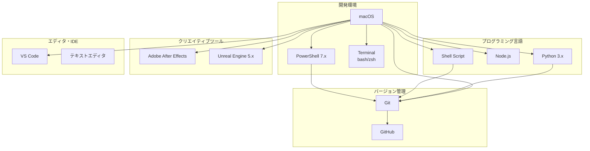
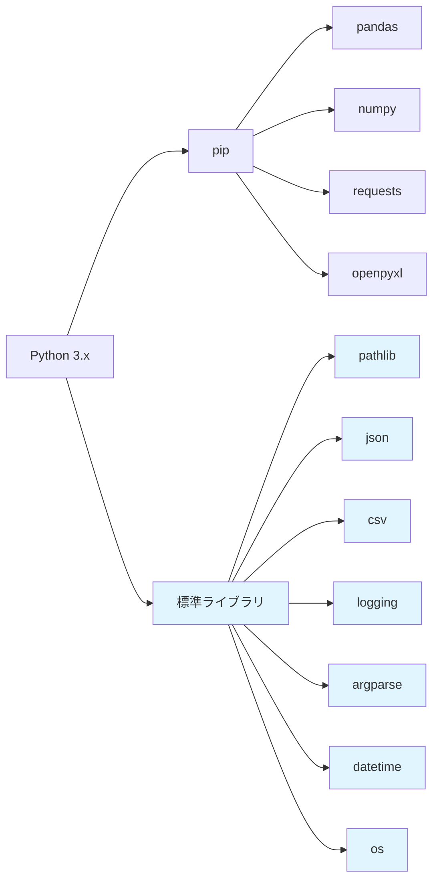
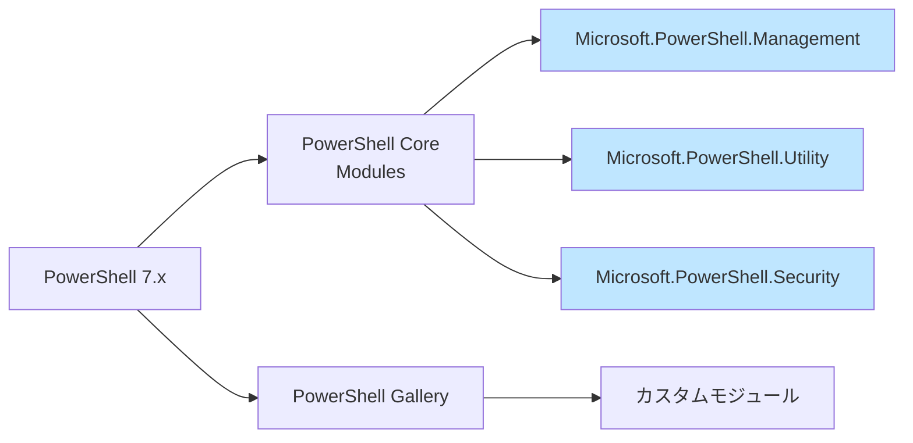
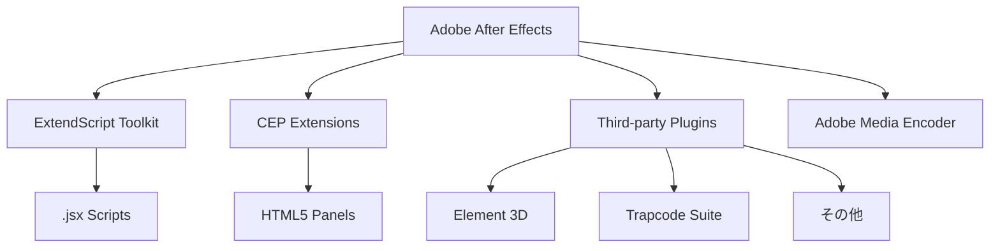
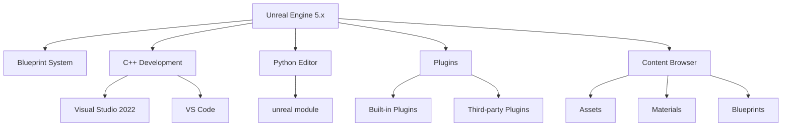
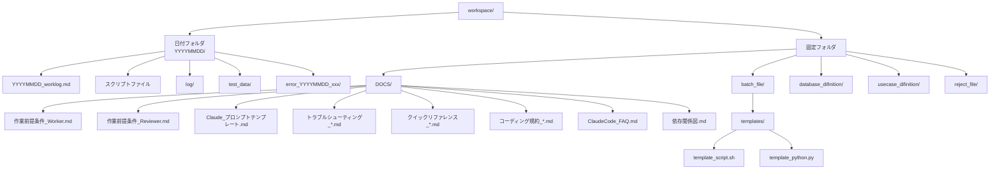
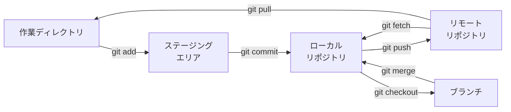
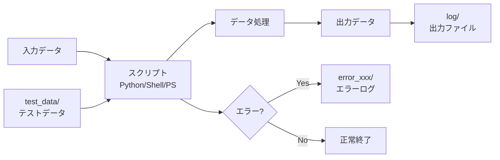
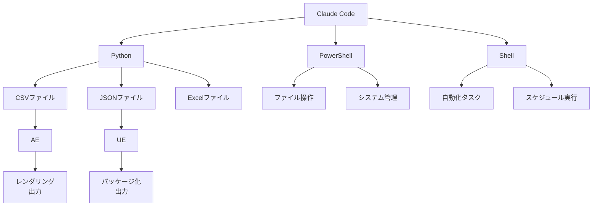
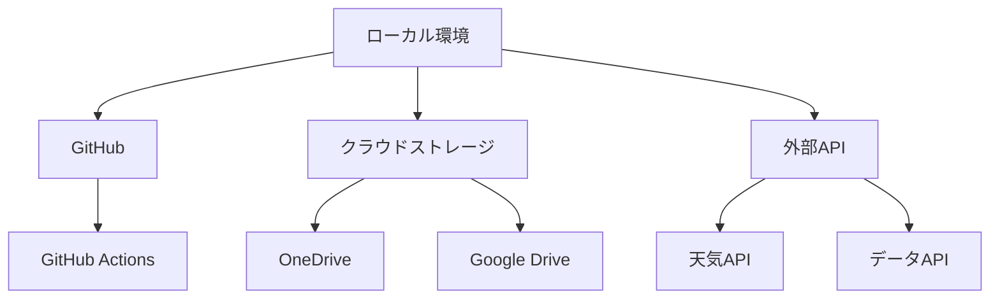

# 依存関係・使用ツール一覧図

## システム構成図



---

## Python 依存関係



---

## PowerShell モジュール依存関係



---

## After Effects 依存関係



---

## Unreal Engine 依存関係



---

## ワークスペース構造



---

## Git ワークフロー



---

## データフロー



---

## ツール間の連携



---

## 外部サービス連携（オプション）



---

## バージョン情報管理表

**注意**: 以下のバージョン情報は参考値です。実際のバージョンは以下のコマンドで確認してください：
```bash
python --version
powershell --version
git --version
```

### 主要ツールバージョン

| ツール名 | バージョン | インストール場所 | 備考 |
|---------|-----------|----------------|------|
| macOS | Sonoma 14.x | - | OS |
| PowerShell | 7.x | /usr/local/bin/pwsh | Core版（Homebrew経由） |
| Python | 3.x | /usr/local/bin/python3 | Homebrew推奨 |
| Git | 2.x | /usr/bin/git | Xcode Command Line Tools |
| VS Code | Latest | /Applications/Visual Studio Code.app | |
| Adobe After Effects | CC 20xx | /Applications/Adobe After Effects 20xx/ | Creative Cloud |
| Unreal Engine | 5.x | /Users/Shared/Epic Games/ | |

### Pythonパッケージ

| パッケージ名 | バージョン | 用途 |
|-------------|-----------|------|
| pandas | Latest | データ処理 |
| numpy | Latest | 数値計算 |
| requests | Latest | HTTP通信 |
| openpyxl | Latest | Excel操作 |
| pytest | Latest | テスト |

### PowerShell モジュール

| モジュール名 | バージョン | 用途 |
|-------------|-----------|------|
| PSScriptAnalyzer | Latest | 静的解析 |
| Pester | Latest | テスト |

---

## 依存関係の更新手順

### Python パッケージ
```bash
# 一覧確認
pip list

# アップデート
pip install --upgrade package_name

# requirements.txt から一括インストール
pip install -r requirements.txt

# requirements.txt 生成
pip freeze > requirements.txt
```

### PowerShell モジュール
```powershell
# インストール済みモジュール確認
Get-InstalledModule

# アップデート
Update-Module -Name ModuleName

# すべて更新
Get-InstalledModule | Update-Module
```

### Git
```bash
# バージョン確認
git --version

# macOS: Homebrew経由で更新
brew upgrade git

# または Xcode Command Line Tools の更新
xcode-select --install
```

---

## 新しいツール追加時の手順

1. **依存関係の確認**
   - 必要なライブラリ・モジュール
   - バージョン要件

2. **インストール**
   - 公式サイトからダウンロード
   - パッケージマネージャーで取得

3. **環境変数の設定**
   - PATH に追加
   - 必要に応じて他の環境変数を設定

4. **動作確認**
   - バージョン確認コマンド実行
   - 簡単なテスト実行

5. **ドキュメント更新**
   - この依存関係図を更新
   - DOCS/作業前提条件_Worker.md の「特殊ツール」セクションに追加
   - 必要に応じてトラブルシューティング文書を作成

---

## トラブルシューティング

### 依存関係の問題が発生した場合

1. **バージョンを確認**
   ```bash
   python --version
   pip --version
   git --version
   ```

2. **環境変数PATHを確認**
   ```powershell
   $env:Path
   ```

3. **再インストール**
   - アンインストール後、最新版をインストール

4. **ログを確認**
   - エラーメッセージの詳細を読む
   - 該当する言語のトラブルシューティング文書を参照

---

**最終更新日**: 2025年11月13日
**バージョン**: 1.1

**変更履歴**:
- **v1.1** (2025-11-13):
  - Python依存関係図の修正（標準ライブラリを正しく表示）
  - openpyxlを図に追加
  - ワークスペース構造図に依存関係図.mdを追加
  - バージョン情報に確認コマンドの注記を追加
- **v1.0** (2025-11-13): 初版作成

**次回更新時の確認事項**:
- 各ツールのバージョンを最新に更新
- 新しく追加したツール・ライブラリを追記
- 依存関係の変更を反映
